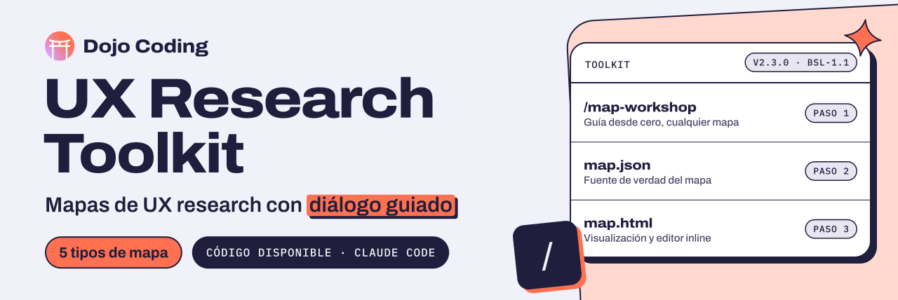

<p align="center">
  <a href="https://dojocoding.io">
    <picture>
      <source media="(prefers-color-scheme: dark)" srcset="docs/assets/banner-dark.svg">
      <source media="(prefers-color-scheme: light)" srcset="docs/assets/banner-light.svg">
      
    </picture>
  </a>
</p>

# UX Research Toolkit

**Mapas de UX research en Claude Code, pensados para quien no tiene experiencia en UX.**

Plugin de Claude Code para crear artefactos de UX research profesionales a traves de dialogo guiado.

[](LICENSE) [](.claude-plugin/plugin.json) [](#instalacion)

[Empezar](#instalacion) · [Tipos de mapa](#tipos-de-mapa) · [Arquitectura](#arquitectura) · [Reportar un problema](https://github.com/DojoCodingLabs/ux-research-toolkit/issues/new)

## Que hace

Guia a usuarios sin experiencia en UX a traves de la creacion de mapas de experiencia e investigacion de usuarios. Genera datos JSON estructurados y visualizaciones HTML interactivas.

## Skills

| Skill | Descripcion |
|-------|-------------|
| `map-workshop` | Entry point principal — guia desde cero para crear cualquier tipo de mapa |
| `experience-map` | Atajo directo para Experience Maps (Day in the Life) |
| `customer-journey-map` | Atajo directo para Customer Journey Maps |
| `service-blueprint` | Atajo directo para Service Blueprints (procesos internos) |
| `storyboard` | Atajo directo para Storyboards (narrativa visual) |
| `user-story-map` | Atajo directo para User Story Maps (planificacion agil) |

## Agents

| Agent | Descripcion |
|-------|-------------|
| `renderer` | Compone HTML interactivo desde JSON + componentes |
| `persona-builder` | Construye/importa user personas desde SRD, BMT, o dialogo |

## Tipos de Mapa

| Tipo | Complejidad | Descripcion |
|------|-------------|-------------|
| **Storyboard** | Baja | Narrativa visual emotiva en escenas secuenciales |
| **Experience Map** | Media | Experiencia general del usuario (Day in the Life) |
| **Customer Journey Map** | Media | Experiencia con un producto/servicio especifico |
| **User Story Map** | Media | Planificacion agil con historias de usuario |
| **Service Blueprint** | Alta | Procesos internos (frontstage/backstage) detras del journey |

## Arquitectura

```
Dialogo guiado → JSON (fuente de verdad) → HTML interactivo (visualizacion + editor)
```

- **JSON-first**: Schemas modulares con perfiles por tipo de mapa
- **HTML components**: Piezas reutilizables compuestas segun el perfil activo
- **Editor inline**: Edita celdas en el HTML, guarda al JSON via File System Access API
- **Persona import**: Detecta personas existentes de SRD (`personas.yml`) o BMT (`perfil-expectativas-cliente.md`)

## Output

Los artefactos se guardan en `docs/ux-research/maps/{nombre-del-mapa}/`:
- `map.json` — fuente de verdad
- `map.html` — visualizacion interactiva (abrir en Chrome/Edge)

## Instalacion

```
claude plugins install ux-research-toolkit
```

## Requisitos

- Chrome o Edge para editar mapas via File System Access API
- Opcional: business-model-toolkit o srd-framework para importar personas existentes

## Licencia

[BSL-1.1](LICENSE). Construido por [Dojo Coding](https://dojocoding.io).

<p align="center">
  <a href="https://dojocoding.io"></a>
</p>
